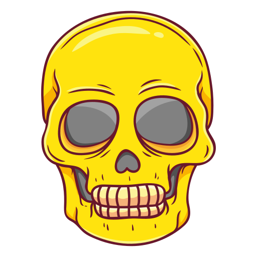

<h1 align="center">Custom Cursor CSS </h1>
<ul align="left">
  <li>This repository demonstrates how to create a custom cursor for your website using CSS and JavaScript, specifically featuring a skull design.</li>
  <li>This unique cursor enhances user interaction and adds a fun element to your web application.</li>
</ul>
<p align="center">If you like this project, please give it a ⭐ star to show your support!</p>

<div align="center">
  <a href="https://github.com/Pradeep-1496/Skull_cursor/stargazers"></a>
  <a href="https://github.com/Pradeep-1496/Skull_cursor/fork"></a>
  <a href="https://github.com/Pradeep-1496/Skull_cursor/issues"></a>

</div>


## Demo

You can see a live demo of the project [here](https://github.com/Pradeep-1496/Skull_cursor).


[](https://github.com/Pradeep-1496/Skull_cursor/blob/main/myscripts.js)
 
 


## Customization
Feel free to customize the cursor image and animations:
- Replace the skull.png file with your own image.
- Adjust the size and scale effects in the CSS for different visual experiences.


## HTML

The structure includes a simple form and a div for the custom cursor:
```bash
  <div id="cursor"></div>
 ```


## Overview

The Skull Cursor project uses CSS to style a custom cursor that follows the mouse movements across the screen. When users hover over elements, the cursor scales down for a neat effect. This implementation is simple yet effective, allowing for an engaging user experience.

## Features

- Custom skull-shaped cursor that follows the mouse.
- Smooth scaling animation on hover.
- Simple HTML and CSS structure for easy modification and integration.
- Responsive design compatible with modern browsers.

## Installation

To get started, clone the repository:

```bash
git clone https://github.com/Pradeep-1496/Skull_cursor.git
cd Skull_cursor
